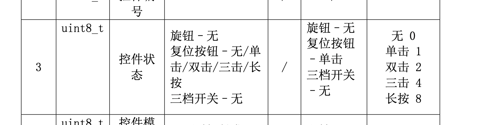
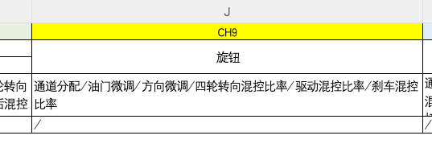
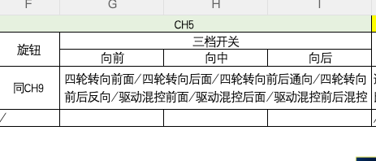

## 疑问
### bug5 硬件
 按操作我看到蓝牙发送数据为,要发送端那边限制下范围首页通道值: CH1=111, CH2=0, CH3=-100, CH4=-100, CH5=0, CH6=-100, CH7=-100, CH8=-100, CH9=-100, CH10=75, CH11=-100
I/flutter (14768): [HomeDashboard] 首页通道值: CH1=111, CH2=0, CH3=-100, CH4=-100, CH5=0, CH6=-100, CH7=-100, CH8=-100, CH9=-100, CH10=74, CH11=-100
I/flutter (14768): [HomeDashboard] 首页通道值: CH1=111, CH2=0, CH3=-100, CH4=-100, CH5=0, CH6=-100, CH7=-100, CH8=-100, CH9=-100, CH10=75, CH11=-100
I/flutter (14768): [HomeDashboard] 首页通道值: CH1=111, CH2=0, CH3=-100, CH4=-100, CH5=0, CH6=-100, CH7=-100, CH8=-100, CH9=-100, CH10=74, CH11=-100
I/flutter (14768): [HomeDashboard] 首页通道值: CH1=111, CH2=0, CH3=-100, CH4=-100, CH5=0, CH6=-100, CH7=-100, CH8=-100, CH9=-100, CH10=75, CH11=-100
I/flutter (14768): [HomeDashboard] 首页通道值: CH1=111, CH2=0, CH3=-100, CH4=-100, CH5=0, CH6=-100, CH7=-100, CH8=-100, CH9=-100, CH10=74, CH11=-100
I/flutter (14768): [HomeDashboard] 首页通道值: CH1=111, CH2=0, CH3=-100, CH4=-100, CH5=0, CH6=-100, CH7=-100, CH8=-100, CH9=-100, CH10=75, CH11=-100

###  bug6 产品
APP菜单-控件分配的CH9类型的默认设置是无，CH10类型的默认是单击，点开类型，却没有这个选项，包括CH5和CH6也是这个问题
#### CH9 类型选项改为 无/旋钮    
1. 需求这样要改成这样吗?
2. 如果这样的话,协议目前不支持

#### CH5 产品
1. 旋钮 也要增加无吗?
2. 如果这样的话,协议目前不支持

#### CH6 产品
1. 也要增加无吗?

### bug8 硬件
1. 四轮转向开关/履带混控开关/驱动混控开关/刹车混控开关/四轮转向模式切换/履带混控切换/驱动混控切换/刹车混控切换  是payload[8]吗?值分别是多少协议文档有些没有标注

### bug11 硬件
📱 手机发送 cmd=controlMapping(0x1D) bytes=30 payload=A5 30 1D 09 00 04 00 00 00 03 02 02 11 00 00 00 00 00 00 00 00 00 00 00 00 00 00 00 AE 5A
I/flutter (18617): [BluetoothIO] ☎️ 设备发送 cmd=controlMapping(0x1D) bytes=30 payload=A5 30 1D 01 20 00 00 00 00 00 00 00 00 00 00 00 00 00 00 00 00 00 00 00 00 00 00 00 C0 5A
1. 麻烦硬件看下有啥问题

### bug12 产品
1. 如果CH1 设置为60 -> 进入失控保护的值为100 
这个要怎么处理

### bug13 产品
我看需求和反馈问题不符合

### bug15 硬件
1.操作有数据发送
 📱 手机发送 cmd=systemSetting(0x1E) bytes=30 payload=A5 40 1E 04 08 60 02 00 00 00 00 00 00 00 00 00 00 00 00 00 00 00 00 00 00 00 00 00 F9 5A
I/flutter (14768): [BluetoothIO] ☎️ 设备发送 cmd=systemSetting(0x1E) bytes=30 payload=A5 40 1E 01 20 00 00 00 00 00 00 00 00 00 00 00 00 00 00 00 00 00 00 00 00 00 00 00 98 5A  有发送数据

### bug25 UI
1. 点击是那个样式 UI图上没看到对应效果

### bug29 产品
1. 需求范围是0-100 
2. 原型上面是-100-0-100 
3. UI上是100-0-100(左边100 和右边100有啥区别)